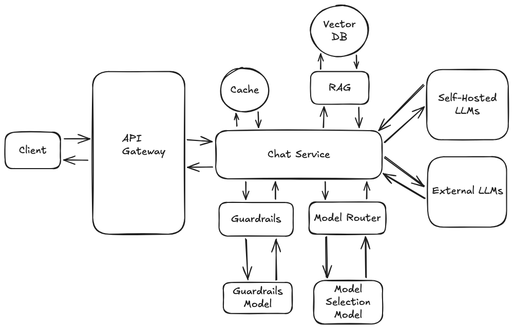

# LLM-Powered Chatbot

## Problem Statement
Design a basic chatbot system that accepts user messages, sends them to a Large Language Model (LLM), and streams back coherent responses — supporting multi-turn conversations with context retention.

---

## Requirements

### Functional
- Users can send messages and receive responses from an LLM
- System maintains conversation history for multi-turn context
- Responses are streamed back in real time
- Support both self-hosted and external LLM providers
- Augment responses with relevant context via RAG
- Filter unsafe or out-of-scope inputs and outputs via Guardrails

### Non-Functional
- Low latency first token response
- Scalable to handle multiple concurrent users
- Conversation history persisted across sessions

---

## High-Level Architecture

---

## Core Components

| Component | Responsibility |
|---|---|
| **Client** | Sends user messages and renders responses |
| **API Gateway** | Auth, rate limiting, and routes requests to the Chat Service |
| **Chat Service** | Central orchestrator — coordinates all components to produce a response |
| **Cache** | Stores frequently requested responses to reduce redundant LLM calls |
| **RAG** | Retrieves relevant context chunks to augment the prompt |
| **Vector DB** | Stores and indexes embeddings for semantic search used by RAG |
| **Guardrails** | Validates inputs and outputs against safety and policy rules |
| **Guardrails Model** | ML model that powers the Guardrails safety checks |
| **Model Router** | Selects the most appropriate LLM based on cost, latency, or task type |
| **Model Selection Model** | ML model that informs the routing decision |
| **Self-Hosted LLMs** | Internal LLMs for cost-sensitive or data-privacy-sensitive workloads |
| **External LLMs** | Third-party providers (OpenAI, Anthropic, etc.) for general-purpose tasks |

---

## Component Deep Dive

### Client
The client is the interface through which users interact with the chatbot. It is responsible for capturing user input, sending it to the backend, and rendering the streamed response. Clients can take several forms:

- **Web Browser** — a web app (React, Vue, etc.) that communicates with the backend over HTTP/WebSocket
- **Mobile App** — a native iOS or Android app, or a cross-platform app (React Native, Flutter) that integrates the chat UI
- **Embedded Chat Window** — a chat widget embedded inside another product (e.g. a customer support window, a docs site, or an IDE plugin)

### API Gateway
The API Gateway is the single entry point for all client requests. It sits between the client and the backend services, handling cross-cutting concerns so the Chat Service does not have to. Key responsibilities include:

- **Authentication & Authorization** — validates identity (JWT, API keys, OAuth tokens) and enforces access control before any request reaches the backend
- **Rate Limiting** — caps the number of requests per user or IP over a time window to prevent abuse and control LLM cost
- **DDoS Protection** — detects and drops anomalous traffic spikes before they overwhelm downstream services
- **Request Filtering** — rejects malformed, oversized, or disallowed requests early in the pipeline
- **Request Routing** — directs traffic to the appropriate backend service based on path, headers, or version
- **Load Balancing** — distributes incoming traffic evenly across multiple Chat Service instances to prevent hotspots and improve availability
- **SSL/TLS Termination** — handles HTTPS at the gateway layer so backend services can communicate over plain HTTP internally, reducing certificate management overhead
- **Circuit Breaking** — detects failing downstream services and stops forwarding requests to them, preventing cascading failures across the system
- **Retry Logic** — automatically retries failed requests to the Chat Service or LLM provider with exponential backoff to improve resilience against transient failures
- **Usage Metering** — tracks request and token consumption per user or tenant, enabling quota enforcement, billing, and cost attribution
- **IP Allowlist / Blocklist** — permits or denies traffic at the network level based on IP address before it reaches any application logic
- **Streaming Support** — since LLM responses are streamed token-by-token, the gateway maintains long-lived connections (HTTP/2 server-sent events or WebSocket) and proxies the stream directly to the client without buffering the full response

**Technologies:**
- *Open Source* — Kong, NGINX, Traefik, Envoy, Tyk
- *Managed / Closed Source* — AWS API Gateway, Google Apigee, Azure API Management, Cloudflare API Shield

### Cache
The cache sits in front of the LLM and stores previous responses to avoid redundant and costly model calls. Rather than simple exact-match caching, this system uses **semantic caching** — meaning it can serve cached responses not just for identical queries but also for queries that are semantically similar.

**How it works:**
- When a new request comes in, the Chat Service generates an embedding of the user's query and performs a **vector similarity search** against previously cached query embeddings stored in Redis
- If a sufficiently similar query is found (above a configurable similarity threshold), the cached response is returned directly without hitting the LLM
- If no match is found (cache miss), the request proceeds to the LLM; once a response is generated, both the query embedding and the response are stored in Redis to populate the cache for future requests

**Similarity Score Thresholds:**

Similarity is typically measured using **cosine similarity**, which produces a score between 0 and 1 — where 1 is an exact match and 0 is completely unrelated. The threshold determines how close a query needs to be to a cached query to be considered a hit:

- **High threshold (e.g. ≥ 0.95)** — only near-identical queries are served from cache; safer and more accurate but results in a lower cache hit rate
- **Medium threshold (e.g. 0.85 – 0.95)** — catches paraphrased or slightly reworded versions of the same question; good balance for most use cases
- **Low threshold (e.g. < 0.85)** — more cache hits but higher risk of returning a response that does not actually match the user's intent

The right threshold depends on the application — a FAQ-style bot can tolerate a lower threshold safely, whereas an open-ended assistant should err on the higher side to avoid serving stale or mismatched responses.

**Embedding Models:**

The quality of semantic caching is directly tied to the embedding model used. The query at cache-write time and cache-lookup time must use the same model:

- *Open Source* — `all-MiniLM-L6-v2` (384 dims, fast and lightweight), `all-mpnet-base-v2` (768 dims, higher accuracy) via Sentence Transformers
- *Closed Source / Managed* — OpenAI `text-embedding-3-small` (1536 dims) and `text-embedding-3-large` (3072 dims), Cohere Embed, Google `text-embedding-gecko`

Smaller dimension models are faster and cheaper to store; larger dimension models capture more semantic nuance and tend to produce better similarity scores.

**Data Structure in Redis:**

Each cache entry is stored as a **Redis Hash** alongside an indexed vector field, using the **RediSearch** module:

- `query` — the original query text
- `response` — the full LLM response
- `embedding` — the query vector stored as a `VECTOR` field (float32 array)
- `created_at` — timestamp of when the entry was cached
- `ttl` — expiry set on the key to evict stale responses automatically

The vector index uses either a **FLAT** index (brute-force, suitable for small datasets) or an **HNSW** (Hierarchical Navigable Small World) index for approximate nearest-neighbour search at scale — HNSW trades a small amount of recall accuracy for significantly faster lookup times.

In a Redis Cluster, typical search latencies are:
- **FLAT index** — O(n) brute-force scan; ~1–10ms for datasets up to ~100K vectors, degrades linearly beyond that
- **HNSW index** — O(log n) approximate search; ~1–5ms even on millions of vectors, making it the practical choice for production workloads

Both figures exclude the network round-trip to the Redis Cluster (~0.1–1ms on a local network), which is negligible compared to the LLM call latency (typically hundreds of milliseconds to a few seconds).

**Operations Overview:**

1. **Embed** — incoming query is passed through the embedding model to produce a fixed-dimension vector
2. **KNN Search** — RediSearch runs a K-nearest neighbour query against all stored vectors, returning the top match(es) with their cosine similarity scores
3. **Threshold Check** — if the top match score meets or exceeds the configured threshold, the cached response is returned immediately
4. **Cache Miss Path** — query is forwarded to the LLM; on response, the query text, response, and embedding are written to a new Redis Hash entry and indexed
5. **TTL Expiry** — Redis automatically evicts entries past their TTL, keeping the cache fresh and preventing stale responses from being served

**Technologies:**
- *Cache Store* — Redis with the RediSearch module (part of Redis Stack) for vector indexing and KNN search

---

## Data Flow

1. User sends a message from the client
2. API Gateway authenticates the request and forwards it to the Chat Service
3. Chat Service checks the Cache for an existing response to the query
4. If a cache miss, Guardrails validates the input against safety and policy rules
5. Chat Service queries RAG, which performs a semantic search against the Vector DB to fetch relevant context
6. Chat Service builds the final prompt (system prompt + retrieved context + conversation history + user message)
7. Model Router selects the appropriate LLM (self-hosted or external) using the Model Selection Model
8. The selected LLM generates a response, which is streamed back to the Chat Service
9. Guardrails validates the LLM output before it is returned
10. Chat Service streams the response back to the client via the API Gateway
11. Response is stored in Cache for future reuse

---

## Trade-offs & Considerations

- **RAG vs. fine-tuning** — RAG is easier to keep up to date but adds retrieval latency; fine-tuning bakes knowledge into the model but requires retraining cycles
- **Model routing** — routing to cheaper or self-hosted models reduces cost but may affect response quality for complex queries
- **Guardrails latency** — running safety checks on both input and output adds round-trip overhead; async or batched checks can mitigate this
- **Cache hit rate** — caching works well for repetitive queries but has low utility in open-ended conversational settings
- **Context window limit** — older messages must be truncated or summarized as conversations grow long
- **Streaming vs. REST** — WebSockets give a better UX for streaming but add connection management complexity
